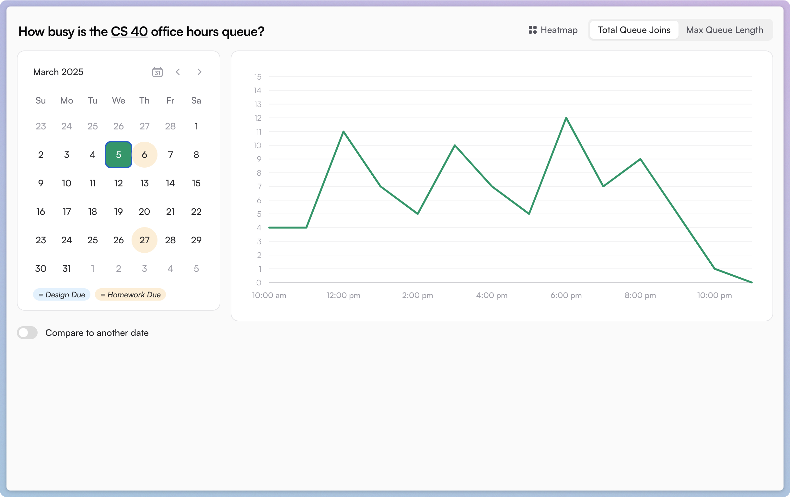
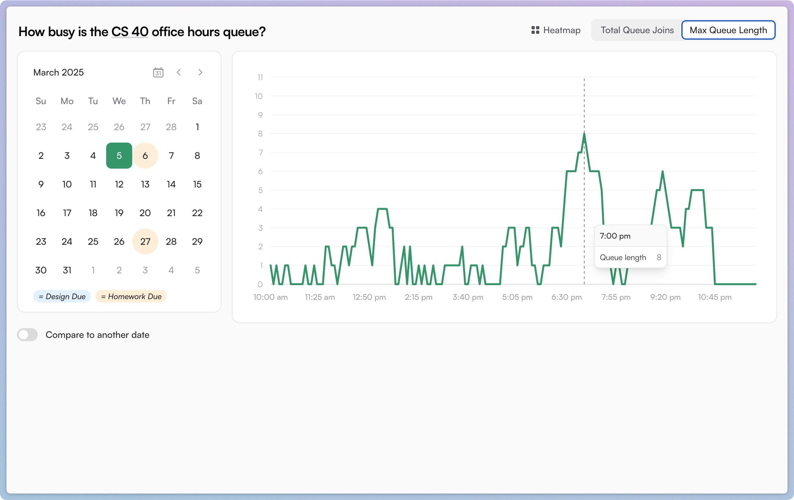

This past year at Tufts, I was a TA for [CS 40](https://www.cs.tufts.edu/comp/40): _Machine Structure and Assembly Language Programming_.

CS 40 is a somewhat-infamous class in the Tufts sequence, consisting of eight pair-programming projects that take quite a lot of time. On the bright side, <mark>the CS department runs office hours for CS 40 every weekday from 10am until 11pm,</mark> plus slightly more limited hours on the weekends.

Students end up spending a lot of time in office hours debugging C programs with TAs. I was curious: how busy does it get? Can we quantify the flurry of activity before a deadline, or the gap around 7pm for dinner?

To answer these questions, I built **queuecounter**, a website that automatically tracks how busy office hours are.

---

Collecting data is actually pretty easy: CS 40 doesn't have an office hours _room_ — partners just sit anywhere on the second floor of the CS building and put themselves onto a virtual queue using a CLI tool called `halligan40`. When it's your turn, a TA will remove you from the queue and come find you.

Initially, I wrote a Node.js script on our shared department server that ran `halligan40 check_queue` every two seconds and sent the length of the queue to my remote server.

I then realized that I was being dumb: `halligan40` is powered by a PHP script running on a professor's personal website. I had access to the Python script, and could see the endpoint that it was hitting (without authentication, mind you).

I switched my approach to just have my remote server hit the professor's API every two seconds and record the result. (I'm sorry.) No script on the department servers necessary.

---

I graphed the results, and now could construct a graph with the <mark>Max Queue Length</mark> over a day. Higher numbers meant that the queue was large before the TAs could beat it back down.

Then, I realized that "how long is the queue this hour?" is a slightly different metric than "how many *times* did pairs join the queue this hour?". The former measures a student's perceived experience waiting; the latter measures the objective number of times that people had questions.

So I also began recording and graphing <mark>Total Queue Joins</mark> per hour. I was able to do this without storing any personal information (I don't understand FERPA but this feels related) by hashing the student's name, location on the second floor, and the timestamp when they joined the queue — all as a single unique identifier for _a singular time someone joined the queue_.

The above two screenshots, from the day *before* the most notorious assignment was due, tell a story:

> Office hours were unusually busy throughout the daytime (people joined the queue 5-12 times per hour), but the TAs mostly had trouble keeping the queue down in the **evening** (peaking at 8 people in line around 7pm).

---

I also aggregated the semester's data into a heatmap:

- It looks like office hours were busiest in the afternoon, around 3-6pm.
- If you look for it, you _can_ in fact see a dinner break around 6:30-8:30pm before things pick back up.

---

By the time you're reading this, I've taken down the website — and given the professor's server a reprieve from being pung every two seconds during waking hours.

However, the Laravel app I built for this is [open source on GitHub](https://github.com/benborgers/queuecounter/blob/main/app/Console/Commands/CheckQueue.php). And to preserve FERPA, or whatever, I've even excluded the professor's unsecured API endpoint :)

